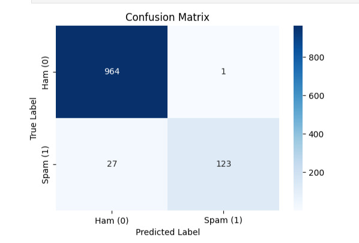
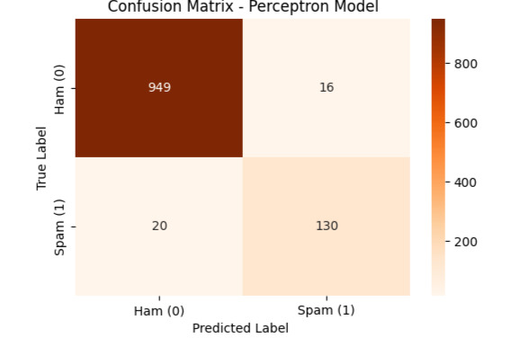

# 📩 Email & SMS Spam Detector using NLP (Naive Bayes vs. Perceptron)

This is an end-to-end Natural Language Processing (NLP) and Machine Learning project. The goal of this project is to analyze text messages or emails and automatically classify them as either **Spam** or **Ham** (Legitimate). 

In this project, I built and compared **two different models**: a probabilistic model (**Multinomial Naive Bayes**) and a single-layer neural network (**Perceptron**).

---

## 🛠️ Project Workflow

1. **Data Cleaning & Normalization**:
   - Used `Pandas` and Regular Expressions (`Regex`) via `.str.replace()` to remove unnecessary special characters (`?`, `...`, `!!!`) and numbers.
   - Converted all text to lowercase using `.str.lower()` to maintain uniformity.

2. **Text Processing & Lemmatization**:
   - Utilized the `spaCy` library to perform lemmatization, reducing words to their base or dictionary form (e.g., "running" becomes "run").

3. **Feature Extraction (TF-IDF)**:
   - Used Scikit-Learn's `TfidfVectorizer` to transform the clean text data into a high-dimensional mathematical matrix.
   - Handled stopword removal effortlessly by passing `stop_words='english'` and restricted the vocabulary to the top 2,500 features.

---

## 📊 Results & Model Comparison

Both models were tested on an unseen test split (20% of the dataset) and delivered outstanding performance, validating that text data in high-dimensional space is highly linearly separable.

### 1. Multinomial Naive Bayes Model
- **Description:** A probabilistic classification model highly suited for text feature frequencies.
- **Accuracy:** `97%` . Achieved a highly stable performance on text classification.

#### 📈 Naive Bayes Confusion Matrix:

  

---

### 2. Perceptron Model (Single-layer Neural Network)
- **Description:** A linear baseline neural network that updates its weights based on misclassifications.
- **Accuracy:** **`96%`** 🔥

#### 📈 Perceptron Confusion Matrix:

  

---

## 💻 Tech Stack & Tools
- **Language**: Python 3.12
- **Models**: MultinomialNB, Perceptron (Single-layer Neural Network)
- **Libraries**: Pandas, Scikit-Learn, spaCy, Matplotlib, Seaborn, Regex
- **Platform**: Kaggle Notebook (CPU Mode)
